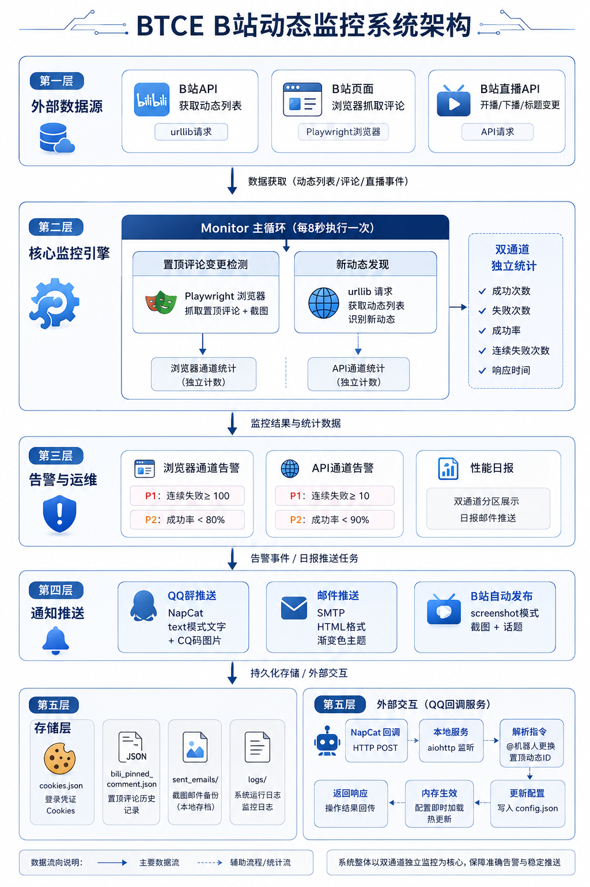

# B站动态监控系统 (BTCE 4.16) 项目说明

## 项目简介
BTCE 4.16 是基于 Python + Playwright 的 B站动态/直播监控系统。核心流程：API 动态列表发现 + 置顶自动识别 → Playwright 抓取置顶评论 → 邮件/QQ/B站三通道推送（模式可配）。支持 QQ 群 @机器人 指令（更换置顶、切换手动/自动模式、更新Cookie）。v4.16 将 screenshot 模式改为固定宽度卡片渲染：评论内容继续走 DOM，作者/时间/IP 走评论 API，评论图片铺满内容区，避免 B站新版动态裁切宽图。

## 项目结构

```
BTCE3.0/
├── main.py                  # 主入口，协调整体调度
├── config.py                # 全部配置集中于此（动态/直播/浏览器/告警）
├── monitor.py               # 核心监控：动态发现 + 置顶评论检测 + 推送 + 自动发布
├── pinned_card_renderer.py  # 置顶评论卡片渲染（v4.16：DOM内容+API元信息+Playwright出图）
├── auto_publish.py          # B站动态自动发布（图片上传+发布API，v4.2）
├── bili_api.py              # B站新版 polymer API 客户端（v4.14: +_fetch_raw()原始数据+module_tag）
├── pinned_dynamic_monitor.py # 置顶动态自动发现+手动/自动双模式（v4.14）
├── render_comment.py        # 评论渲染调度器（抓取+变更检测+分发到邮件/QQ）
├── email_renderer.py        # 邮件HTML渲染（渐变主题+截图内嵌）
├── qq_message_generator.py  # QQ消息生成（纯文本/CQ码）
│
├── live_monitor.py          # 直播间状态监控（开播/下播/标题变更+v4.6 room_init状态标签）
├── monitor_scheduler.py     # 直播监控调度器（定时轮询+通知）
│
├── email_utils.py           # 邮件发送工具
├── qq_utils.py              # QQ消息发送工具
├── qq_callback_server.py    # QQ回调服务器（接收NapCat事件，@机器人指令）
├── cookie_renewer.py         # Cookie远程更新（v4.7: 邮件二维码→扫码→自动保存）
├── get_cookies.py           # 浏览器Cookie获取脚本
│
├── health_check.py          # 系统健康检查
├── performance_monitor.py   # 性能监控（内存/成功率/P1P2告警）
├── status_monitor.py        # 状态监控（无更新时长告警）
├── self_monitor.py          # 直播失败计数器
├── retry_decorator.py       # 网络/浏览器重试装饰器
├── logger_config.py         # 日志系统配置
├── color_config.py          # 邮件渐变主题色生成
│
├── config_custom.example.py # 个性化文案配置示例（v4.14: config_custom模式）
├── config_email.example.py  # 邮箱配置示例
├── config_qq.example.py     # QQ配置示例
│
├── assets/                  # 卡片资源（PNG 示例签名）
├── requirements.txt         # Python依赖
├── LICENSE                  # MIT 开源协议
├── mermaid-diagram.png      # 架构流程图
│
├── README.md                # GitHub README
└── 说明.md                  # 本文件
```

## 各模块详细说明

### 核心入口

| 文件 | 作用 |
|------|------|
| `main.py` | Application 类管理全部生命周期，启动动态监控 + 直播监控 + 定期状态检查，优雅处理 SIGINT/SIGTERM |
| `config.py` | 全部配置集中管理——UP主信息、直播间号、浏览器参数、检查间隔、告警阈值、邮件/QQ配置导入 |

### 动态监控核心（v4.5）

| 文件 | 作用 |
|------|------|
| `monitor.py` | Monitor 类：Playwright 浏览器驱动，主循环 ①置顶评论变更检测 ②API 动态列表发现新动态 ③定期检测置顶是否更换(截图+邮件通知) ④按 QQ_MODE/EMAIL_MODE/BILI_MODE 分流推送 ⑤B站自动发布。v4.16 screenshot 模式先生成卡片，失败回退旧截图 |
| `pinned_card_renderer.py` | 置顶评论卡片渲染：DOM 评论内容 + 评论 API 元信息（作者/ctime/IP属地）+ 头像缓存 + Playwright 固定宽度 PNG；评论图片满宽；签名路径可配置 |
| `auto_publish.py` | B站动态自动发布模块：上传截图到图床、组装 JSON 发布图文动态（话题+链接），异步触发不阻塞通知 |
| `bili_api.py` | BiliAPI 类：调用新版 polymer `feed/space` API 获取动态列表，urllib 同步请求 + asyncio.to_thread 包装，仅需 Cookie 无需 WBI 签名（v4.5 从旧版 api.vc 迁移） |
| `render_comment.py` | CommentRenderer 类：抓取置顶评论 HTML + 图片（含 Shadow DOM 穿透），文本/图片变更检测，分发到 EmailRenderer/QQMessageGenerator |
| `email_renderer.py` | EmailRenderer 类：构建完整邮件 HTML（渐变主题色 header + 新/旧评论对比 + 截图 base64 内嵌/text模式文字+表情+图片） |
| `qq_message_generator.py` | QQMessageGenerator 类：生成 QQ 群消息，text模式=纯文本+alt表情+图片CQ码，screenshot模式=截图 |

### 直播监控

| 文件 | 作用 |
|------|------|
| `live_monitor.py` | LiveMonitor 类：aiohttp 调用 B站直播 API（双接口容错），检测开播/下播/标题变更；v4.6 新增 room_init API 获取加密/锁房/隐藏/付费状态标签，附加到通知消息 |
| `monitor_scheduler.py` | LiveMonitorScheduler 类：定时轮询直播间状态，状态变化时触发邮件+QQ 通知 |

### 通知工具

| 文件 | 作用 |
|------|------|
| `email_utils.py` | SMTP 邮件发送（HTML 格式） |
| `qq_utils.py` | QQ 群消息推送（支持 CQ 码图片+多群） |
| `qq_callback_server.py` | NapCat HTTP 事件回调服务器（@机器人 更换置顶/切换手动/切换自动/测试/更新凭证）v4.14 新增模式切换+状态显示B站置顶vs监测动态 |

### 监控与运维

| 文件 | 作用 |
|------|------|
| `health_check.py` | HealthChecker：双通道成功率统计（置顶评论+API）、浏览器状态检查、磁盘/内存检查 |
| `performance_monitor.py` | 性能监控：内存跟踪、双通道 P1/P2 告警（置顶评论+API 各自独立阈值）、日报含双通道统计 |
| `status_monitor.py` | 状态监控：最后变更时间追踪、超28小时无更新告警 |
| `self_monitor.py` | LiveFailureCounter：直播监控连续失败计数+成功率告警 |
| `retry_decorator.py` | BROWSER_RETRY_CONFIG / NETWORK_RETRY_CONFIG 两个重试装饰器 |
| `logger_config.py` | 日志配置：格式、轮转、子logger管理 |
| `color_config.py` | 邮件渐变主题色随机生成器 |

### 配置文件

| 文件 | 说明 |
|------|------|
| `config_email.py` | SMTP 服务器、端口、发件人、密码、收件人列表（含隐私信息，不提交 git） |
| `config_email.example.py` | 邮箱配置模板（可提交 git） |
| `config_qq.py` | QQ 群 ID 列表、推送开关 |
| `config_qq.example.py` | QQ 配置模板（可提交 git） |

### 数据文件

| 文件 | 说明 |
|------|------|
| `cookies.json` | B站登录 Cookie，由 `get_cookies.py` 生成或手动配置 |
| `bili_pinned_comment.json` | 置顶评论历史（HTML+图片+时间），用于变更检测 |
| `monitor_status.json` | 监控运行状态快照 |



## v4.14 架构流程图

```
main.py 启动
  ├─ Application.run()
  │   ├─ 动态监控 (Monitor.run)
  │   │   └─ 每N秒循环 (config_custom可配置):
  │   │       ├─ ① Playwright 浏览器 打开置顶动态页 → 抓取置顶评论 → 变更检测
  │   │       │   └─ → health_checker.increment_success/failure (浏览器统计)
  │   │       ├─ 有变更时:
  │   │       │   ├─ QQ推送 (text模式纯文本+alt+图片，秒推不阻塞)
  │   │       │   ├─ 邮件推送 (text模式文字+表情+图片，不阻塞)
  │   │       │   ├─ 截图 (高DPI #comment 元素)
  │   │       │   └─ B站发布 (screenshot模式，用截图发布动态)
  │   │       ├─ ② BiliAPI 获取动态列表 → 对比 seen_dynamics → 类型过滤 → 新动态截图 → 邮件+QQ
  │   │       │   └─ → health_checker.increment_api_success/failure (API独立统计)
  │   │       ├─ ③ 定期检测置顶是否更换 (PINNED_CHECK_INTERVAL)
  │   │       │   ├─ API module_tag 识别B站置顶
  │   │       │   ├─ 自动模式: 更换→更新目标→截图→gradient邮件通知
  │   │       │   └─ 手动模式: API照查但不自动切换(QQ回调可切)
  │   │       └─ 性能记录 (performance_monitor.record_cycle → P1/P2 + 日报双通道)
  │   │
  │   ├─ 直播监控 (LiveMonitorScheduler)
  │   │   └─ 每15秒: API查询直播间状态 → 开播/下播/标题变更检测 → 邮件+QQ
  │   │
  │   └─ 系统状态检查 (每1小时)
  │       └─ 健康检查 + 无更新告警 + 直播失败统计
```

## 使用方法

### 1. 安装依赖
```bash
pip install -r requirements.txt
```

主要依赖：`playwright>=1.40.0`, `beautifulsoup4>=4.12.0`, `aiohttp>=3.9.0`, `psutil>=5.9.0`, `requests>=2.31.0`, `lxml>=4.9.0`

### 2. 安装 Playwright 浏览器
```bash
playwright install chromium
```

### 3. 配置 Cookie
- 运行 `python get_cookies.py` 自动获取，或手动将B站Cookie写入 `cookies.json`

### 4. 配置通知方式
- 复制 `config_custom.example.py` → `config_custom.py`，填写个性化文案（UP主昵称、QQ消息文案、邮件标题等），不填则用通用默认值
- 复制 `config_email.example.py` → `config_email.py`，填写SMTP信息
- 复制 `config_qq.example.py` → `config_qq.py`，填写QQ群ID

### 5. 添加监控目标
编辑 `config_custom.py`（不存在则复制 `config_custom.example.py`）：
```python
UP_UID = "目标UID"
UP_NAME = "目标名称"
```

### 6. 运行
```bash
python main.py
```

## 关键配置说明（config.py）

```python
# 监控目标
UP_UID = ""                                     # B站UID
PINNED_DYNAMIC_ID = ""                             # 置顶动态ID（v4.14起自动发现，可手动覆盖）
CHECK_INTERVAL = 6                                # 动态检查间隔（秒）
PINNED_CHECK_INTERVAL = 3600                      # 置顶更换检测间隔（秒，默认1h）

# 个性化配置（config_custom.py）
# 任何变量在 config_custom.py 中定义后自动覆盖 config.py 默认值
# 包括: UP_NAME, CHECK_INTERVAL, QQ消息文案, 邮件标题等

# 置顶评论卡片渲染（v4.16）
CARD_WIDTH = 1080                                 # 卡片宽度
CARD_MIN_HEIGHT = 890                             # 最小高度，避免宽图被 B站裁切
CARD_COMMENT_IMAGE_WIDTH = 0                      # 0=铺满内容区；正数=固定像素宽
CARD_SIGNATURE_PATH = "assets/signature_example.png"  # 示例签名（由SVG转换）；实际签名在 config_custom.py 覆盖
CARD_SCALE_FACTOR = 1                             # 1=1080宽；1.5=1620；2=2160

# 直播
LIVE_ROOM_ID = 0                                 # 直播间房间号
LIVE_CHECK_INTERVAL = 15                          # 直播检查间隔（秒）

# 浏览器
BROWSER_CONFIG = {"headless": True, ...}          # Chromium 无头模式
BROWSER_RESTART_INTERVAL = 100                    # v4.8页面复用后减少重启频率

# 告警
P1_TOTAL_FAILURE_THRESHOLD = 100                  # 浏览器累计失败告警
P2_SUCCESS_RATE_THRESHOLD = 0.8                   # 浏览器成功率告警
API_P1_FAILURE_THRESHOLD = 10                     # API连续失败告警（更快响应）
API_P2_SUCCESS_RATE_THRESHOLD = 0.9               # API成功率告警（更严格）
MEMORY_THRESHOLD_MB = 1500                        # 内存告警阈值
```

## 注意事项

- Cookie 有效期有限，定期更新
- Playwright headless 浏览器内存占用约 200-500MB，建议定期重启
- 请求频率需遵守 B站限制
- `config_email.py` 含敏感信息，已在 `.gitignore` 中排除

## 免责声明

本项目仅供学习交流使用。使用者应遵守 Bilibili 平台的相关服务条款，不得用于任何违法违规用途。因使用本项目产生的任何后果由使用者自行承担，开发者不承担任何责任。

## 版本信息

- **项目名称**：B站动态监控系统 (BTCE)
- **当前版本**：v4.16
- **更新内容**：置顶评论 screenshot 模式改为固定宽度卡片渲染；评论内容走 DOM，作者/时间/IP 走评论 API；评论图片满宽；示例签名 PNG 可替换
- **Python 要求**：3.9+（服务器3.9，本地3.13，代码须兼容3.9）
- **最后更新**：2026年10月22日
